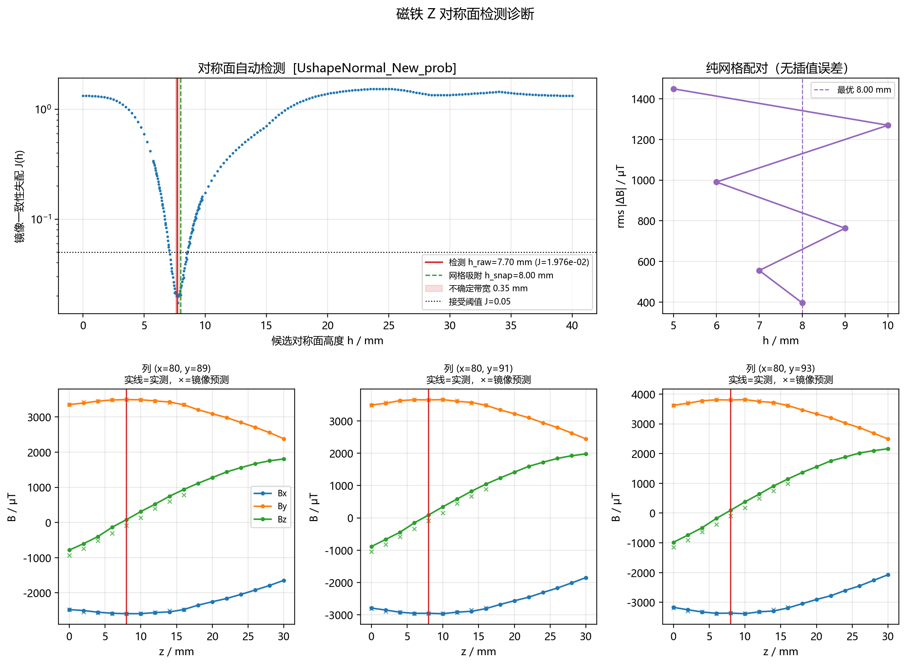
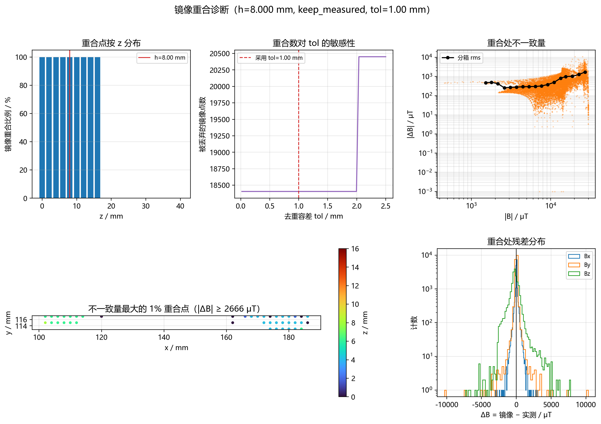

# 对称面检测与镜像增强

代码：`src/symmetry.py`（公用模块 + 命令行）。

---

## 1. 问题：小探头测穿了对称面

反演需要足够的测点。历史上测点只覆盖磁铁**一侧**，于是把每个测点沿厚度方向镜像一份
（$z\mapsto 2h-z$，$\mathbf B$ 按奇偶性翻转）来补齐另一侧，其中 $h$ 是磁铁厚度的
对称面高度，靠手工填 `(Z_MIN + Z_MAX)/2`。

换成**小探头**之后，扫描已经跨过了磁铁的对称面，镜像个体会**落在实测点坐标上**：

- 新数据集 `UshapeNormal_New_prob` 在 $h=8$ mm 时，48784 个实测点里有 **18405 个**
  （**37.7%**）与镜像候选点重合；
- 重合处的两条数据**并不相等**（探头定位误差 + 噪声 + 磁铁本身的不对称），
  直接镜像相当于同一位置塞了两份互相矛盾的数据，既重复计权又引入偏差。

所以要做两件事：**用数据自身把 $h$ 定准**，以及**给重合点一个明确的处理策略**。

---

## 2. 原理：$h$ 处的镜像奇偶性

设磁化强度位于 $x\text{-}y$ 面内、沿 $z$ 均匀分布（$M_z=0$）。把源按 $z=h\pm t$
成对配对：$\mathbf M\cdot\mathrm d\mathbf r$ 与 $z$ 无关，因此绕 $z=h$ 有

$$B_x(x,y,\,2h-z)=B_x(x,y,z),\qquad
B_y(x,y,\,2h-z)=B_y(x,y,z),\qquad
B_z(x,y,\,2h-z)=-B_z(x,y,z)$$

即 **$B_x/B_y$ 偶、$B_z$ 奇**。

!!! warning "别凭直觉写符号"
    这与"电流分布镜像不变"的情形**符号相反**。本项目早期就是靠直觉写的，
    所以 `symmetry.py --regression` 里专门留了一条与旧公式的对照。

于是可以定义**镜像一致性目标**：

$$J(h)=\frac{1}{3}\sum_{k\in\{x,y,z\}}
\frac{\sum \Delta B_k^2}{\sum B_k^2},
\qquad
\Delta\mathbf B=\mathbf B(2h-z)-(B_x,\,B_y,\,-B_z)\big|_{z}$$

$J$ 是无量纲相对失配：$J\ll1$ 说明数据确实关于该平面镜像对称；$J\approx1$ 说明
完全没有这种对称性（单侧数据即如此）。在测量 $z$ 跨度内扫描 $h$，$J$ 的**极小值**
就是对称面。

### 实现细节

| 步骤 | 做法 |
|---|---|
| 分列 | 按 $(x,y)$ 把测点组成 $z$ 向列，只保留点数 ≥5 且 $z$ 跨度 ≥6 mm 的列 |
| 重采样 | 每条列用**三次样条**重采样到统一 $z$ 网格，好让 $z$ 与 $2h-z$ 逐点比较 |
| 粗扫 → 精扫 | 先粗扫定位凹坑，再在坑内精扫；最后在凹坑内部做**抛物线细化**（避免被扫描边界带偏） |
| 吸附 | 候选高度取所有 $2h$ 恰落在实测 $z$ 平面上的值。若与最优点之差 ≤ `max(0.3mm, 带宽)` 就吸附过去，**免掉镜像插值误差** |
| 接受判据 | 配对数 ≥200、有效列 ≥50、$J_{\min}\le0.05$、$J_{\min}\le0.2\,J_{\text{median}}$、凹坑带宽 ≤2 mm。任一不过 → **拒绝**并回落几何中面（行为与旧版完全一致） |

---

## 3. 实测结果

`data/raw/UshapeNormal_New_prob/`（6 个扫描文件，48784 点，$x\in[79,207]$、
$y\in[89,249]$、$z\in[0,40]$ mm）：

```
检测结果 h_raw = 7.698 mm   (J = 1.9763e-02)
不确定带宽  = [7.55, 7.90] mm (宽 0.35 mm)
网格吸附候选 h_snap = 8.000 mm (|Δ| = 0.302 mm)
配对数 = 126790  有效列 = 4029
J 中位数(全扫描范围) = 1.3344
h* 处各分量相对失配 J_k:  Bx=3.5e-04  By=5.2e-04  Bz=5.8e-02
各分量信噪比粗估:          Bx=70       By=28       Bz=39
采用 h = 8.000 mm   accepted = True
```

几个值得注意的点：

- **凹坑很深**：$J_{\min}=0.0198$ 相对全扫描中位数 1.334，比值 0.015 ≪ 0.2，
  说明数据确实有很强的镜像对称性。
- **$B_z$ 是主要信息来源**：$B_x/B_y$ 的失配只有 $10^{-4}$ 量级（几乎完美对称），
  而 $B_z$ 是 $6\times10^{-2}$ —— 因为对称面高度只通过 $B_z$ 的奇性被"看见"。
- **纯网格配对交叉校验**（不做任何插值，只在实测 $z$ 平面上找配对）独立复现了同一个值：

| $h$ / mm | 配对数 | rms$\lvert\Delta B\rvert$ / µT（$x,y,z$） |
|---|---|---|
| **8.00** | 18405 | **[203.9, 233.3, 750.7]** |
| 7.00 | 16360 | [270.9, 303.9, 1091.0] |
| 9.00 | 20450 | [333.5, 358.4, 1597.5] |
| 6.00 | 14315 | [362.6, 410.6, 2198.1] |
| 10.00 | 22495 | [613.3, 639.3, 2556.9] |
| 5.00 | 12270 | [438.8, 495.8, 3412.6] |

  $h=8$ 在两个方向上都比邻居好，且偏差随 $\lvert h-8\rvert$ 单调增大 —— 这比
  单纯报一个最优点更有说服力。



*$J(h)$ 的凹坑、不确定带宽、以及吸附到实测 $z$ 网格的候选位置。*

---

## 4. 重合点怎么处理

`apply_mirror` 的策略由 `--policy` 决定：

| 策略 | 含义 | 何时用 |
|---|---|---|
| `keep_measured`（**默认**） | 镜像点若落在实测点附近（容差内）就**直接丢弃**，只在实测未覆盖的空区补镜像点。**实测值永远优先** | 相信实测、不想让镜像数据影响已有测点 |
| `average` | 重合对做对称化平均 $\mathbf B\gets\frac12\bigl(\mathbf B(p)+\mathbf R\,\mathbf B(\sigma p)\bigr)$，剩余镜像点补进空区 | 想利用镜像约束去噪 |

去重容差默认自适应：`0.5 ×` 最近邻距离中位数（本数据集 = **1.000 mm**，对应扫描间距 2 mm）。

本数据集在 $h=8$ mm、`keep_measured` 下的装配结果：

```
实测点 48784 → 镜像候选 48784 → 其中重合 18405（丢弃）→ 补点 30379
最终点数 79163
```

重合处两条数据的不一致量（实测 vs 镜像）：

| 分量 | rms | 相对该分量 rms | 与噪声比较 |
|---|---|---|---|
| $B_x$ | 203.9 µT | 2.09% | 1.9× 噪声（107 µT） |
| $B_y$ | 233.3 µT | 2.50% | 0.9× 噪声（249 µT） |
| $B_z$ | 750.7 µT | 23.62% | **6.2× 噪声（121 µT）**，均值 −236.1 µT |

$B_z$ 的不一致明显超出噪声，而且**集中在靠近磁铁的点上**（最差的 10 个点里 8 个在
`y=117`，即磁腿下端面附近，$\lvert\Delta B_z\rvert$ 到 7~10 mT）。这更像是
"探头离磁体太近时定位误差被放大 + 磁铁本身并非理想对称"，而不是检测错了平面 ——
因为**纯网格配对**（不插值、只用实测值）给出的最优高度同样是 $h=8$。



*重合点的空间分布与不一致量。*

---

## 5. 自测与回归

```bash
# 合成数据自测（不需要外部文件）：8/8 通过
python src/symmetry.py --selftest

# 在真实数据上检测 + 出图（图默认写到仓库根的 figures/）
python src/symmetry.py data/raw/UshapeNormal_New_prob

# 与旧版"无条件镜像"公式做回归对照
python src/symmetry.py data/raw/UshapeNormal_New_prob --regression
```

自测覆盖：人造对称面高度的还原、重合判定、重合不一致量的统计、
以及 `average` 策略下"对称化后镜像失配恒为 0"这条精确性质。

作为库使用：

```python
from symmetry import load_measurements, estimate_symmetry_plane, apply_mirror

P, B, meta = load_measurements("data/raw/UshapeNormal_New_prob/*.csv")
res = estimate_symmetry_plane(P, B)          # res.h / res.band / res.accepted / res.reason
P2, B2, rep = apply_mirror(P, B, res.h)      # 默认 policy="keep_measured"
```

!!! tip "可直接粘进 notebook"
    命令行的最后会打印一段现成参数：

    ```
    SYMMETRY_H = 8.0000        # mm (symmetry.py 自动检测)
    OVERLAP_POLICY = 'keep_measured'
    数据装配: 实测 48784 -> 最终 79163 点
    ```
