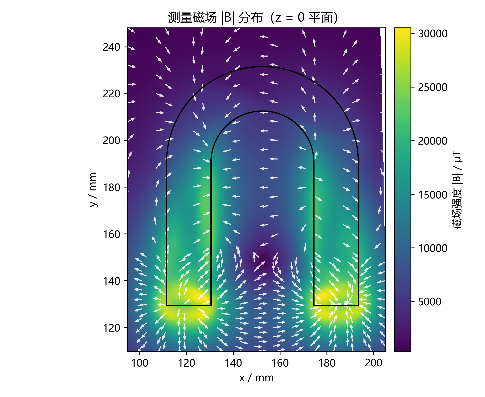
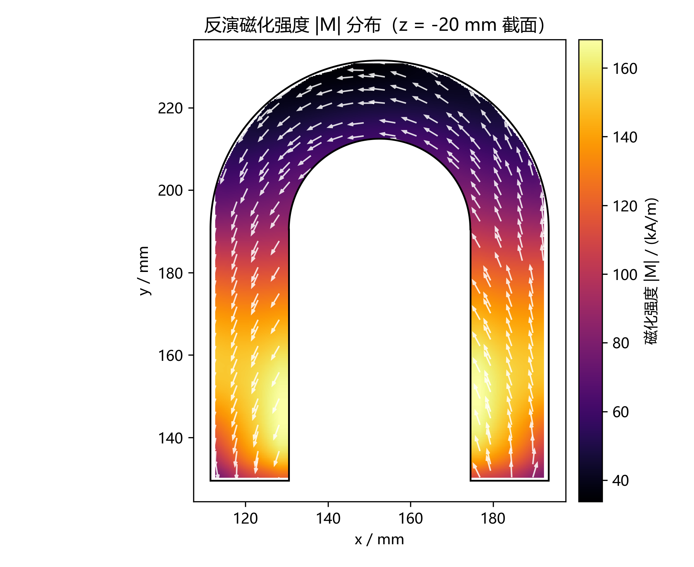
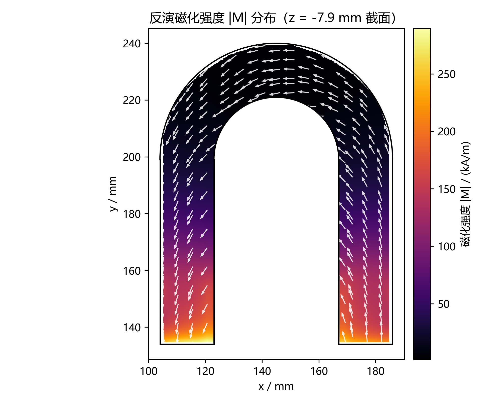
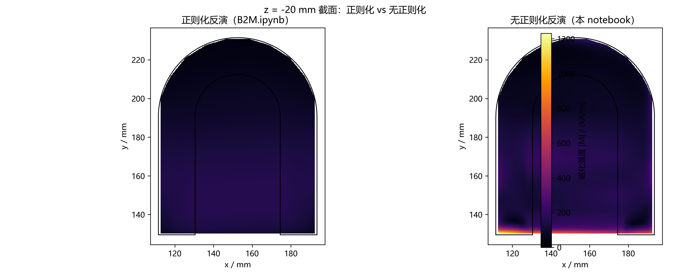

# 数据集与结果

## 1. 测量数据集

三套数据，CSV 格式统一为 `x, y, z, Bx, By, Bz`（坐标 mm、磁场 µT）：

| 目录 | 文件 | 测点数 | 说明 | 谁在用 |
|---|---|---|---|---|
| `data/raw/specialU/` | `N_leg.csv` / `S_leg.csv` / `whole.csv` | 3696 / 2816 / 720 | 早期"特殊 U"磁铁，两腿分开扫 | `notebooks/B2M.ipynb` |
| `data/raw/UshapeNormal/` | `Large.csv` / `legs.csv` | 4200 / 7056 | 圆弧区 4 mm 间距、磁腿区 2 mm 间距 | `notebooks/B2M_noreg.py`、`notebooks/plot_2d_sections.py` |
| `data/raw/UshapeNormal_New_prob/` | `magnetic_field_{N,S,front,up,inside,curve}.csv` | 3968 / 4960 / 15360 / 13888 / 8432 / 2176，**合计 48784** | **小探头**重测：测点跨越了磁铁对称面，$z\in[0,40]$ mm | `notebooks/B2M_newprob.py`、`src/symmetry.py` |
| `data/raw/legacy/` | `U_normal_magnetic_field.csv`、`U_special_B.csv` | 975 / 975 | 更早的两组测量，仅存档 | — |

---

## 2. 磁铁几何

三套数据对应三块不同的磁铁（或同一块磁铁的不同测量），几何参数**不通用**：

| 参数（mm） | `specialU` | `UshapeNormal` | `UshapeNormal_New_prob` |
|---|---|---|---|
| $x$ 范围 | 104 – 186 | 111.5 – 193.5 | 96 – 186 ⚠️ |
| $y$ 范围 | 134 – 240 | 129.5 – 231.5 | 120 – 250 ⚠️ |
| $z$ 范围 | −28 – 0 | −35 – −3 | −8 – 24 ⚠️ |
| 外半径 $R_{\text{out}}$ | 41 | 41 | 45 ⚠️ |
| 内半径 $R_{\text{in}}$ | 22 | 22 | 18 ⚠️ |
| 厚度 $T$ | 28 | 32 | 32 ⚠️ |
| 基础体素 | 1.5 | 1.5 | 1.5 |
| 加密分界 $y_{\text{split}}$ | 144 | 144 | 144 |

几何模型：$U$ 形 = 上半圆环（$R_{\text{in}}\le r\le R_{\text{out}}$，圆心 $(X_c,Y_c)$）
+ 下半两条直腿（$y\le Y_c$ 的两条竖条），$Y_c=Y_{\max}-R_{\text{out}}$。

!!! danger "新数据集的几何是占位值（⚠️）"
    `UshapeNormal_New_prob` 的几何**没有实测**，是从扫描范围反推的粗估：

    - `magnetic_field_inside.csv` 覆盖 $x\in[125,157]$ ⇒ 槽宽 ≈33 mm、$X_c\approx141$；
    - `N`/`S` 扫描分别在 $x\le94$ / $x\ge189$ ⇒ 外侧面在 96 / 186 附近；
    - `front` 扫描 $y\le117$ ⇒ 磁腿下端面 $y\approx119$；
    - **$z$ 厚度 $T$ 无法从外部场反演**（$z$ 向均匀分布时外部场只依赖 $M\!\cdot\!T$），
      必须用卡尺实测。

    代码里 `GEOMETRY_IS_PLACEHOLDER = True` 会在每次运行时大声警告。
    填充实测尺寸后请把它置为 `False`。
    **本数据集的反演绝对幅值暂时不要引用**，但"对称面 $h=8$ mm""重合 37.7%"
    以及全部方法学结论（`meshtest/`）都不依赖这组占位尺寸。

---

## 3. 反演结果

### 3.1 测量磁场（`UshapeNormal`，扫描平面 $z=0$）



*4200 + 7056 个测点的 $\lvert\mathbf B\rvert$ 分布。U 形轮廓在磁场图上清晰可辨 ——
这就是反演能work的原因：外部场的空间结构直接编码了内部磁化分布。*

### 3.2 反演出的磁化强度（`UshapeNormal`，磁铁中面）



*正则化反演的 $\lvert\mathbf M\rvert$ 在中面的分布，叠加磁铁几何轮廓。
幅值在 $10^5$ A/m 量级（钕铁硼永磁体的典型剩磁）。*



*同一套流程在 `specialU` 数据上的结果。*

### 3.3 正则化到底在做什么



*左：带正则化（$w_f$ 按体积、$\lambda=10^{-10}$、$\varepsilon=4\times10^3$ A/m）。
右：完全去掉正则化项的纯最小二乘解。两者对数据的拟合都很好，但右侧的幅值
在空间上剧烈振荡 —— 这正是"解不唯一，得靠挑解规则"的直接证据。*

### 3.4 新数据集（小探头）目前的状态

| 项目 | 结果 |
|---|---|
| 对称面自动检测 | $h=8.000$ mm（原始最优点 7.698 mm，带宽 [7.55, 7.90] mm，已吸附到实测 $z$ 网格） |
| 数据装配 | 实测 48784 → 镜像补点 30379 → **最终 79163 点**（重合的 18405 个镜像副本被丢弃） |
| 几何一致性校验 | 任何测点（含镜像补点）都不允许落进磁铁实体内部，违反了直接报错 |
| 反演本身 | 流程跑通，但因为几何是占位值，**结果暂不发布** |

---

## 4. 结果文件在哪

`data/derived/` 里放的是**可由原始数据 + 脚本重新生成**的中间产物，
**不纳入 git**（见根目录 `.gitignore`），换台机器 clone 下来不会有它们：

```
data/derived/
├── specialU/                 Large.vtk / legs.vtk（csv2vtk 转出的结构化点云）
│                             inverted_M_results_{newmesh,newoperator}.vtu
├── UshapeNormal/             同上 + inverted_M_results_noreg.vtu（无正则化对照）
├── UshapeNormal_New_prob/    inverted_M_results_newmesh.vtu（⚠️ 占位几何）
│                             mag_structured_*.vtk（6 个扫描文件的场分布）
└── legacy/                   早期结果，仅存档
```

`.vtu` 是 `pyvista`/VTK 的 `UnstructuredGrid`，单元数据里带 `Mx, My, Mz`，
用 ParaView 或 `pyvista.read()` 直接打开。

---

## 5. 局限

1. **点偶极近似**：每个体素当点偶极子。测点离磁体表面太近（< 4~6 个单元尺度）时，
   近似误差会污染反演（`meshtest` 里踩过"真值处残差 = 90σ"的坑）。
2. **$z$ 向不可分辨**：若磁化沿 $z$ 均匀，外部场只依赖 $M\cdot T$，$M$ 与 $T$
   无法同时反演 —— 厚度必须实测。
3. **无真值**：真实磁铁没有"标准答案"，所以方法学结论全部建立在
   `meshtest/` 的合成真值对照实验上（独立 1 mm 细网格正演，避免 inverse crime）。
4. **未做**：各向异性 TV、L0/L1 稀疏先验、以及真实 U 形几何 + 真实点云上的
   $\lambda$ 标定值。
